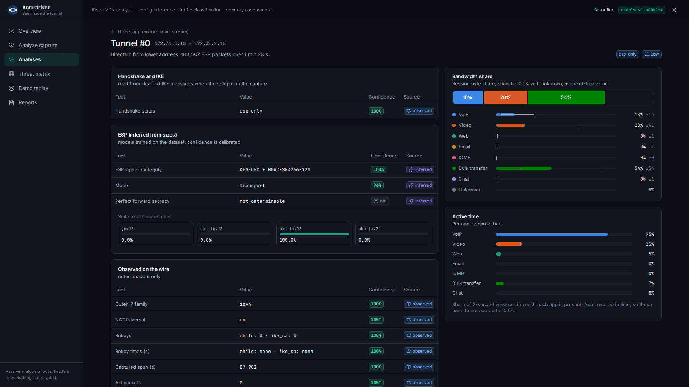
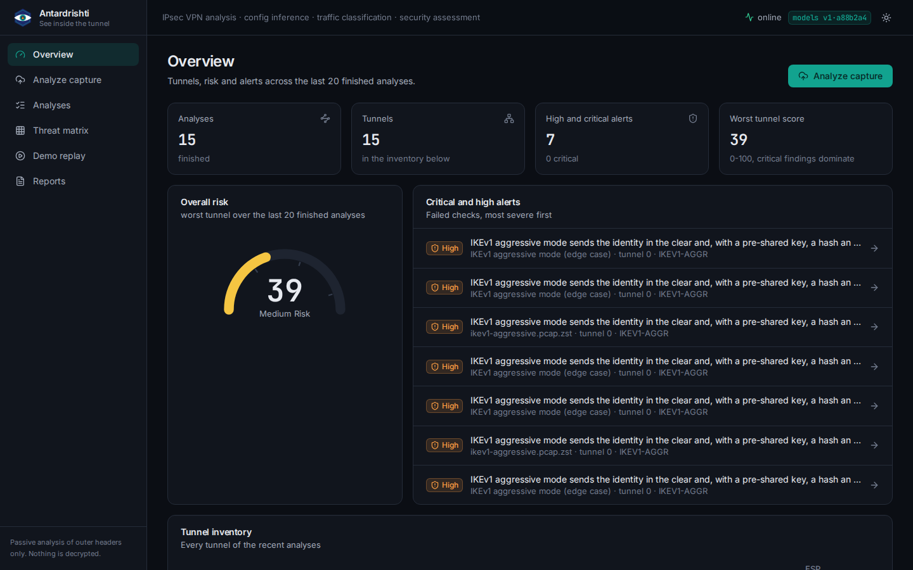
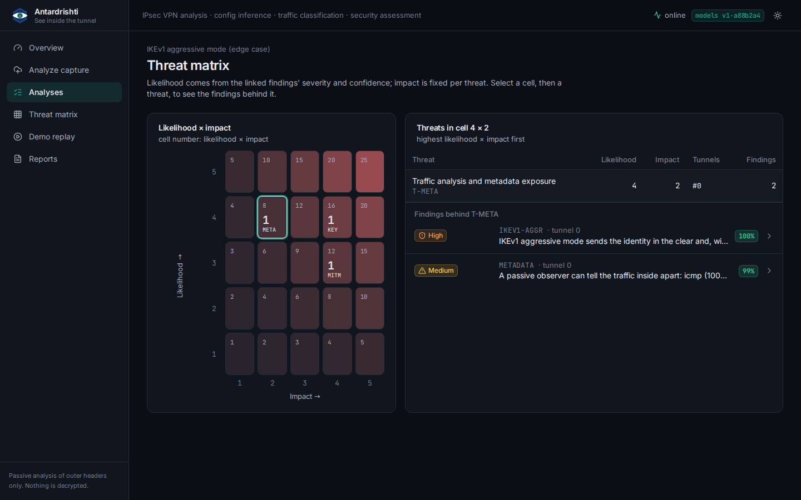
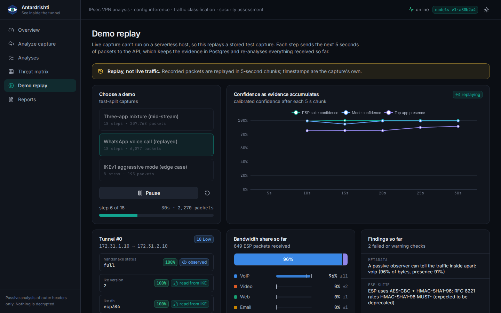
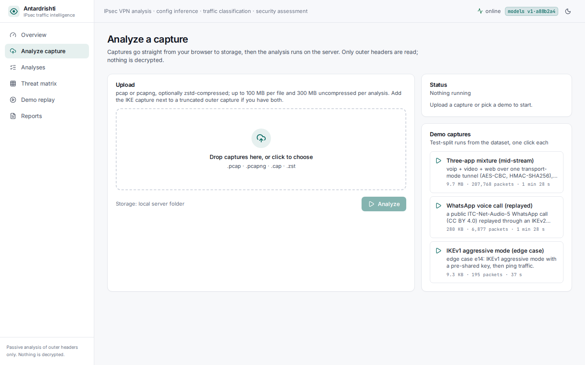
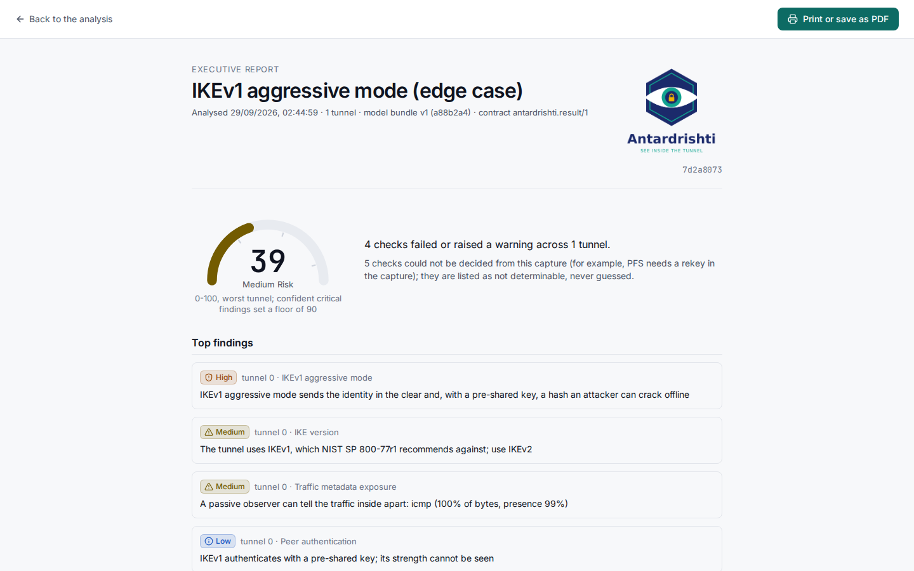
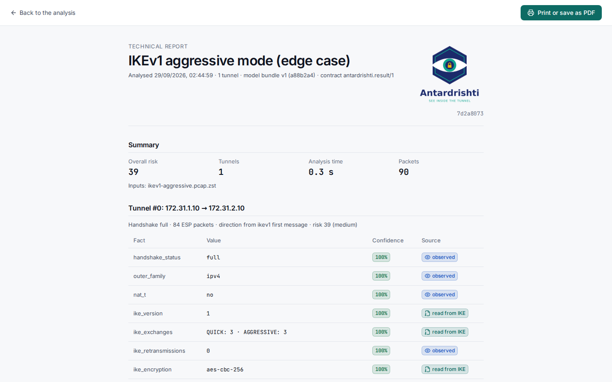
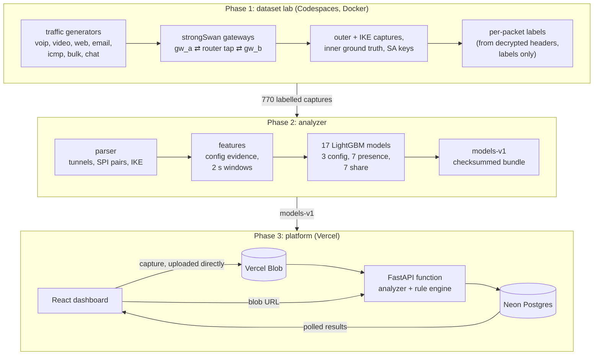

<p align="center">
  <picture>
    <source media="(prefers-color-scheme: dark)" srcset="app/web/public/brand/logo-dark.png">
    
  </picture>
</p>

<p align="center">
  <b>AI-driven, passive analysis of IPsec VPN traffic.</b><br>
  Infers a tunnel's configuration, identifies the traffic inside ESP and assesses its security
  against the standards, from the encrypted packets alone, without decrypting anything.
</p>

<p align="center">
  <a href="https://antardrishti-zeta.vercel.app"><b>Live demo</b></a> ·
  <a href="analyzer/REPORT.md">Evaluation report</a> ·
  <a href="dataset/README.md">Dataset datasheet</a> ·
  <a href="DEMO.md">Run locally</a> ·
  <a href="DEPLOY.md">Deploy</a>
</p>

---

*Antardrishti* (Sanskrit, अन्तर्दृष्टि: "inner vision", "insight") is built for the Smart
India Hackathon 2026. An IPsec VPN hides what it carries, but it cannot hide everything: the
handshake is partly in the clear, ESP packet sizes reveal the cipher and mode, and the rhythm
of the packets gives away the kind of traffic. Antardrishti turns those side channels into a
report an operator can act on:
- which IPsec tunnels a capture contains, and how their handshake went;
- how each tunnel is configured, and how sure the model is;
- what is flowing inside, with bandwidth shares and error bars;
- which settings break RFC 8221, RFC 8247 or NIST SP 800-77r1, how risky the tunnel is, and
  what to fix.

The repository holds the whole project: a lab that built a labelled IPsec dataset of 770
captures and 39.6 million ESP packets, the 17 LightGBM models trained on it, and a web
platform (FastAPI, PostgreSQL, React) that runs them, live on Vercel's free tier.

## Contents

- [What it does](#what-it-does)
- [Live demo](#live-demo)
- [Screenshots](#screenshots)
- [How it works](#how-it-works)
- [Results](#results)
- [Phase 1: the dataset](#phase-1-the-dataset)
- [Phase 2: the analyzer](#phase-2-the-analyzer)
- [Phase 3: the platform](#phase-3-the-platform)
- [Quick start](#quick-start)
- [Configuration](#configuration)
- [Testing](#testing)
- [Repository layout](#repository-layout)
- [Limitations](#limitations)
- [Security and privacy](#security-and-privacy)
- [Documentation map](#documentation-map)
- [For maintainers: lab images](#for-maintainers-lab-images)
- [Acknowledgements and licences](#acknowledgements-and-licences)

## What it does

Give it a packet capture (pcap or pcapng, optionally zstd-compressed) taken anywhere on the
path of an IPsec VPN. Antardrishti then:

| step | what you get | how |
|---|---|---|
| **Find the tunnels** | every IPsec tunnel, its endpoints, its SPI pairs and its handshake status (full, rekey-only, ESP-only, failed, IKE-only) | outer IP fragments reassembled, packets grouped by address pair, NAT-T ports, IKE and ESP SPIs |
| **Read the handshake** | IKE version, IKEv1 main or aggressive mode, the negotiated encryption, integrity, PRF and Diffie-Hellman group, key length, notifies, retransmissions, rekeys | parsed from the cleartext IKE_SA_INIT and IKEv1 phase 1 messages |
| **Infer the ESP configuration** | the ESP cipher and integrity (4 wire shapes), tunnel or transport mode, perfect forward secrecy, each with a calibrated confidence | LightGBM models on ESP length residues, minimum sizes and CREATE_CHILD_SA sizes |
| **Classify the traffic inside** | which of voip, video, web, email, icmp, bulk transfer and chat are present in every 2-second window, the session's byte share per app (summing to 100% with "unknown"), active-time shares, error bars | 14 LightGBM models on sizes, timing, bursts and FFT features |
| **Assess the security** | 23 checks with verdict, severity, cited standard, evidence and confidence; a 0-100 risk score per tunnel; a likelihood × impact threat matrix | a table-driven rule engine |
| **Report** | an executive and a technical PDF, generated in the browser | print stylesheets, every number from the API |

Facts come in three kinds, and every one is labelled with its source: **read from IKE** (in
the clear on the wire), **observed** (outer headers, counts, timings) or **inferred** (a model's
prediction, with its confidence). Below 80% confidence a finding is worded "likely". A fact the
capture cannot show, such as PFS when no rekey happened or the ESP AES key size, is reported as
*not determinable*, never guessed.

## Live demo

**https://antardrishti-zeta.vercel.app** (public; hosted on Vercel's free Hobby tier).

- **Analyze capture:** click one of the three demo captures (a three-app mixture, a replayed
  WhatsApp call, and IKEv1 aggressive mode), or drop your own pcap. Please upload only
  captures you are allowed to share.
- **Demo replay:** watches a stored capture arrive in 5-second chunks, with the tunnel's facts
  and confidence updating as evidence builds up. It stands in for live capture, which a
  serverless host cannot do.
- **Threat matrix** and **Reports:** open any finished analysis.

On the live deployment, the 88-second mixture demo (103,587 ESP packets) is analysed in
2.7 seconds.

## Screenshots

<p align="center">
  <a href="app/docs/screenshots/tunnel-dark.png"></a><br>
  <b>Tunnel detail:</b> facts with confidence and source, bandwidth share with error bars, active time, window timeline, findings
</p>

<table>
  <tr>
    <td width="50%" valign="top">
      <a href="app/docs/screenshots/overview-dark.png"></a><br>
      <b>Overview:</b> tunnel inventory, overall risk, alerts
    </td>
    <td width="50%" valign="top">
      <a href="app/docs/screenshots/threats-dark.png"></a><br>
      <b>Threat matrix:</b> likelihood × impact, drill-down to findings
    </td>
  </tr>
  <tr>
    <td valign="top">
      <a href="app/docs/screenshots/replay-dark.png"></a><br>
      <b>Demo replay:</b> confidence rising as 5-second chunks arrive
    </td>
    <td valign="top">
      <a href="app/docs/screenshots/upload-light.png"></a><br>
      <b>Analyze capture</b> (light theme): direct-to-storage upload, polled progress, demos
    </td>
  </tr>
  <tr>
    <td valign="top">
      <a href="app/docs/screenshots/report-executive.pdf"></a><br>
      <b>Executive report:</b> risk, top findings, traffic overview, recommendations (<a href="app/docs/screenshots/report-executive.pdf">PDF</a>)
    </td>
    <td valign="top">
      <a href="app/docs/screenshots/report-technical.pdf"></a><br>
      <b>Technical report:</b> every fact, finding, standard and error bar (<a href="app/docs/screenshots/report-technical.pdf">PDF</a>)
    </td>
  </tr>
</table>

Each picture links to its full page. All screenshots, in both themes and on a phone:
[app/docs/screenshots](app/docs/screenshots), retaken with `python app/docs/screenshots.py`.

## How it works



**One rule shapes everything: the analyzer is a passive observer.** Its features never use IP
addresses, ports, SPIs, absolute timestamps, keys or decrypted fields. Addresses, ports and
SPIs only group packets into tunnels and set the direction. The lab's SA keys exist solely to
build the ground-truth labels. An analysis goes:

1. **Parse** the capture: merge files by time, drop duplicate router copies, reassemble outer
   IP fragments, classify packets (ESP, NAT-T ESP, IKE, keepalive, AH), group them into
   tunnels and SPI pairs, set the initiator, parse IKE.
2. **Infer the configuration** from "config evidence" (ESP length residues mod 16 and mod 4,
   low percentiles and minimum sizes per direction, IKE proposal, CREATE_CHILD_SA sizes) at
   50, 200, 1000 and all packets.
3. **Build 2-second windows** per SPI pair: sizes corrected for the estimated ESP overhead,
   packet counts, size histograms, inter-arrival statistics, bursts, balance ratios, FFT
   peaks (the 50 Hz of 20 ms VoIP frames stands out), neighbour deltas, config context.
4. **Classify** each window: 7 presence models (calibrated, per-app thresholds) and 7 share
   models (cross-entropy on the byte share).
5. **Aggregate** to session byte shares (absent apps zeroed, renormalised, unknown explicit,
   largest-remainder rounding to 100, out-of-fold error bars) and active-time shares.
6. **Assess**: the rule engine turns facts into findings, risk scores and threats.

## Results

Measured on the held-out test split. Thresholds, calibration, early stopping and
hyperparameters come only from grouped out-of-fold predictions on the training split.
Full report: [analyzer/REPORT.md](analyzer/REPORT.md).

| model | metric | test |
|---|---|---|
| ESP suite (4 wire shapes) | accuracy, all packets | **100.0%** |
| ESP suite | accuracy, first 50 ESP packets | 98.5% |
| mode (tunnel or transport) | accuracy, all packets | 95.4% |
| PFS (tunnels with a rekey) | accuracy | 92.9% |
| traffic presence (7 apps) | macro F1, lab test windows | 0.851 |
| traffic share (7 apps) | session byte-share mean absolute error | 4.4 percentage points |

| presence F1 | voip | chat | icmp | video | web | email | bulk |
|---|---|---|---|---|---|---|---|
| lab test windows | 0.996 | 0.951 | 0.928 | 0.797 | 0.786 | 0.751 | 0.747 |

- **Strong:** the ESP suite is read from sizes alone, since each wire shape leaves its own
  length residue. VoIP, chat and ICMP are near perfect. Calibration is good (presence ECE 0.001
  to 0.040).
- **Harder:** video, bulk, email and web are all TCP downloads from the same server inside
  ESP, and in 2-second windows they overlap. Small flows vanish next to large ones in
  mixtures. Mode inference fails only on ping-only tunnels, because pings vary in size and
  leave no fixed-size packet to measure against.
- **Out of distribution:** real internet web traffic (the realism runs) is mostly read as
  bulk. Replayed WhatsApp calls transfer well (F1 0.94); WhatsApp chat does not (F1 0.07).

**Speed:** 0.32 s of analysis per minute of traffic on one core. The largest capture the hosted
analyzer accepts (300 MB) takes 13.4 s and 686 MB of memory.

## Phase 1: the dataset

A reproducible lab on GitHub Codespaces that generates real IPsec traffic, captures it at a
router tap, and labels every ESP packet. Spec: [dataset/CLAUDE.md](dataset/CLAUDE.md);
datasheet: [dataset/README.md](dataset/README.md); labels: [dataset/labels.md](dataset/labels.md).

### Topology

```
host_a (10.1.0.0/24) ── gw_a ══ [ router / tap ] ══ gw_b ── host_b (10.2.0.0/24) ── internet (NAT)
                                      │
                                    noise   (DNS, NTP, HTTP, ICMP outside any tunnel)
```

- **gw_a and gw_b:** strongSwan 5.9.13 on the kernel XFRM backend. gw_a initiates.
- **router:** plain forwarding plus `tc netem`. Every outer capture is taken here: it is the
  analyzer's vantage point.
- **host_b's services:** self-hosted and reproducible: nginx (HLS video, mirrored websites),
  Asterisk (VoIP), dovecot and postfix (email), prosody (XMPP chat), a bulk file server.
- **Isolation:** labs are veth pairs in a per-lab network namespace, with identical addresses and
  MACs derived from the IP, so no lab can be identified from the wire. The gateways drop any
  plaintext toward the WAN.
- **Pinned images:** every image and the media snapshot are pinned by digest on ghcr.io
  ([lab/images.lock](lab/images.lock)); a refused pull is an error, never a local build.

### Experiment design

- **Set A, the size-relevant configs (32):** mode (tunnel, transport) × ESP wire shape
  (AES-GCM-16, AES-CBC with HMAC-SHA1, SHA-256 or SHA-384) × outer family (IPv4, IPv6) × NAT-T
  (on, off). The AES key size is invisible in ESP, so it is drawn per tunnel instead.
- **Set B, the handshake configs (20):** DH group (modp1024, modp2048, ecp256, ecp384,
  curve25519) × PFS × authentication (PSK, certificates), with forced rekeys.
- **Seven traffic classes, from live generators:** VoIP (baresip to Asterisk, G.711 and Opus),
  video (Chromium playing HLS with adaptive bitrate), web (Chromium visiting 38 mirrored pages),
  email (SMTP STARTTLS and IMAP), ICMP, bulk (scp, rsync, curl) and chat (XMPP bots). The dataset
  adds replayed WhatsApp traffic from public captures.
- **Network conditions:** each run draws a netem profile: `lan`, `broadband` (20 ms, 0.1% loss),
  `mobile` (60 ms, 1% loss) or `congested` (120 ms, 2% loss, 5 Mbit/s).
- **26 edge cases**, each checked automatically against its expected observation:

| | | | |
|---|---|---|---|
| e01 IKE, no response | e02 half handshake | e03 no proposal chosen | e04 wrong DH guess |
| e05 authentication failure | e06 cookie challenge | e07 mid-stream only | e08 rekey only |
| e09 IKE SA rekey | e10 idle tunnel with DPD | e11 teardown | e12 forced NAT-T |
| e13 IKEv1 main mode | e14 IKEv1 aggressive | e15 weak crypto (3DES) | e16 NULL encryption |
| e17 lossy handshake | e18 multiple tunnels | e19 AH | e20 replay window off |
| e21 ESN | e22 IKE fragmentation | e23 multiple child SAs | e24 mixed families |
| e25 IP fragmentation | e26 replay attempt | | |

### Tiers

| tier | runs | what | ESP&nbsp;packets | size |
|---|---|---|---|---|
| **P0** | 370 | 192 traffic runs (32 tunnels × 6 apps), 64 short tunnels, 60 handshake, 54 edge | 11.8&nbsp;M | 1.34&nbsp;GB |
| **P1** | 192 | 48 anchor runs, 80 mixtures (10 app combinations × 8 configs), 32 live chat, 8 internet realism, 24 edge | 11.7&nbsp;M | 1.32&nbsp;GB |
| **WhatsApp** | 16 | public WhatsApp captures replayed through the tunnels (8 chat, 8 calls) | 0.07&nbsp;M | 0.10&nbsp;GB |
| **p0s** | 192 | P0's traffic runs recaptured one lab per machine, each the paired twin of its P0 run | 16.0&nbsp;M | 1.84&nbsp;GB |
| **total** | **770** | | **39.6&nbsp;M** | **4.6&nbsp;GB** |

Splits are deterministic and never cross a tunnel:
- **Traffic-like stages:** 25% of the tunnels in each tier and stage are test, stratified by
  mode and wire shape. All runs of a tunnel share its split.
- **Handshake and edge runs:** split per run, 20% test, stratified by scenario.
- **WhatsApp:** split by source file.
- **Realism runs:** all 8 are test only, reported as out of distribution.

All captures and labels are backed up as draft GitHub releases (`p0-data`, `p0s-data`,
`p1-data`, `p1-whatsapp` and their `-labels`), each with a `.sha256`. Draft releases are
visible only to collaborators on this repository.

### Labels and integrity

- **Per-packet labels from each packet's own decrypted header:** the captured start of the
  ESP payload is decrypted with the run's SA keys, and the inner IP header and ports name the
  flow and the app. Median labelled share: 100% in every tier. A tshark spot-check over 17 runs
  found 0 app errors. The keys build labels only and are never model inputs.
- **Parallel labs were tested before they were trusted, and failed.** An adversarial
  classifier told 3-lab captures from serial ones with AUC 0.724 (permutation p 0.005), mostly
  through inter-arrival times. Every capture since then runs one lab per machine, and P0's
  traffic runs were recaptured serially as the p0s tier.
- **Label decisions are documented, not hidden:**
  - scp and rsync transfers that leaked into the next runs keep their bulk label;
  - HTTPS flows that are ambiguous between video and web in mixtures are resolved by the
    schedule, or left out of training and evaluation;
  - internet runs take the run's app.

  See [analyzer/CLAUDE.md](analyzer/CLAUDE.md) section 11.

## Phase 2: the analyzer

Python, numpy and LightGBM. Spec: [analyzer/CLAUDE.md](analyzer/CLAUDE.md); results:
[analyzer/REPORT.md](analyzer/REPORT.md).

| module | role |
|---|---|
| [analyzer/parse.py](analyzer/parse.py) | pcap and pcapng reader (sll2, sll, Ethernet, raw, loop), fragment reassembly, packet classes, tunnel grouping, SPI pairing, direction, handshake status, IKEv1 and IKEv2 parsing; vectorised with numpy over a memory map |
| [analyzer/features.py](analyzer/features.py) | config evidence rows; 2-second window features; window labels |
| [analyzer/config_models.py](analyzer/config_models.py) | suite (multiclass), mode and PFS models; out-of-fold predictions for the traffic models; isotonic calibration |
| [analyzer/traffic_models.py](analyzer/traffic_models.py) | 7 presence models (balanced, early stopping, calibration, per-app thresholds) and 7 share models |
| [analyzer/aggregate.py](analyzer/aggregate.py) | session byte and active-time shares, rounding, error bars |
| [analyzer/evaluate.py](analyzer/evaluate.py) | the report and plots |
| [analyzer/lgbm.py](analyzer/lgbm.py) | a numpy evaluator of the LightGBM models, identical to lightgbm to 0.0 on every cached row, so inference needs no lightgbm, scikit-learn or system OpenMP |
| [analyzer/bundle.py](analyzer/bundle.py), [analyzer/cli.py](analyzer/cli.py) | the checksummed model bundle and the command line |

**Training discipline:**
- CV groups are the tunnel's config hash, so twin runs and reused tunnels never straddle
  folds.
- Config predictions reach the traffic models only out of fold, so no window sees a config
  model trained on its own tunnel.
- Traffic models exclude P0's contention-biased traffic runs.
- The analyzer seed is 26006.

**The model bundle** `models-v1` holds 17 boosters, calibrators, thresholds, the feature schema,
the overhead table, the error table and metadata (data releases and checksums, commit,
library versions), with a `SHA256SUMS` manifest. It is released as `models-v1-a88b2a4.tar.zst`
(1.6 MB) and vendored into the platform at [app/api/models/v1](app/api/models/v1).

**Command line:**

```bash
python -m analyzer.cli analyze capture.pcap [ike.pcap ...] --out result.json
```

The output follows a versioned contract, `antardrishti.result/1`: pydantic models in
[app/schema/v1.py](app/schema/v1.py) and the JSON Schema
[app/schema/result.v1.json](app/schema/result.v1.json). It holds every tunnel, its facts
(value, confidence, source), byte and active-time shares with error bars, and the window
timeline with per-window probabilities.

## Phase 3: the platform

FastAPI, PostgreSQL and React, deployable on Vercel's free tier. Spec, including the design
brief and the Vercel constraints: [app/CLAUDE.md](app/CLAUDE.md).

### Rule engine

The checks live as data in [app/api/rules/table.py](app/api/rules/table.py), one readable row per check:
fact, value patterns, verdict, severity, standard, threats and recommendation. That makes the
thresholds easy to audit and change.

| area | checks |
|---|---|
| IKE cryptography | IKE-ENC (encryption), IKE-KEYLEN (AES key size), IKE-INTEG (integrity), IKE-PRF, IKE-DH (Diffie-Hellman group) |
| ESP | ESP-SUITE (cipher and integrity), ESP-NULL (NULL encryption), AH-ONLY (AH with readable payload), ESP-KEYLEN (not determinable by design) |
| protocol and mode | IKE-VERSION, IKEV1-AGGR (aggressive mode), AUTH (peer authentication), MODE (tunnel or transport), PFS |
| lifetimes | LIFETIME-CHILD, LIFETIME-IKE (from SPI changes and rekey intervals) |
| replay | REPLAY (repeated sequence numbers), REPLAY-WINDOW (anti-replay window and ESN, not determinable on the wire) |
| negotiation | NEGOTIATION (failed negotiation), NOTIFY (error notifies), COOKIE (DoS protection), RETRANSMIT |
| exposure | METADATA (apps identifiable inside the tunnel, with confidence) |

The standards cited are RFC 8221, RFC 8247, NIST SP 800-77r1, RFC 7296 and RFC 4303.

- **Findings:** each carries check id, verdict (pass, warn, fail, info, not determinable),
  severity (critical to info), standard, evidence (fact, value, source) and confidence. The
  confidence is the lowest confidence of the facts the finding rests on.
- **Risk:** 0 to 100 per tunnel. Weights are critical 40, high 20, medium 8 and low 3, each
  times the finding's confidence, capped at 100. A confident critical finding sets a floor of
  90. The overall score is the worst tunnel's.
- **Threat matrix:** 8 threats, each with an impact of 1 to 5: loss of confidentiality, key or
  PSK recovery, IKE downgrade or MITM, retroactive decryption, packet forgery, metadata
  exposure, replay, and DoS. Likelihood comes from the linked findings' severity and
  confidence.

### API

| method | path | purpose |
|---|---|---|
| POST | `/api/uploads` | the Vercel Blob client-upload handshake (a Python implementation of `@vercel/blob`'s token signing) |
| PUT | `/api/uploads/local/{name}` | upload to local storage (self-hosted mode) |
| POST | `/api/analyses` | start an analysis from blob URLs or a demo; it runs inside this request |
| GET | `/api/analyses`, `/api/analyses/{id}` | list analyses; status for polling |
| GET | `/api/analyses/{id}/tunnels`, `.../tunnels/{idx}` | tunnels; tunnel detail with windows and findings |
| GET | `/api/analyses/{id}/findings`, `.../threats`, `.../report` | findings; threat matrix; everything the reports show |
| GET | `/api/overview`, `/api/demos` | dashboard overview; the demo captures |
| POST | `/api/replays`, `/api/replays/{id}/next` | demo replay, one 5-second chunk per call |
| GET | `/api/health`, `/api/model`, `/api/config` | health (database, bundle, scratch space); model bundle and rules; limits |

Interactive API docs are served at `/api/docs`.

**Data model** (SQLAlchemy 2 and Alembic): `analyses`, `tunnels`, `config_facts`, `windows`,
`session_shares`, `findings`, `risk_scores`, `threats`, `replay_chunks`.

### Dashboard

React 19, TypeScript, Vite, Tailwind CSS 4, shadcn/ui-style components on Radix, Apache ECharts
and Framer Motion. It is dark first, with a light theme toggle, and a test checks the text
and severity colours of both themes against WCAG AA. Pages:
- **Overview:** tunnel inventory, risk gauge, critical alerts, recent analyses.
- **Analyze capture:** drag-and-drop straight to Blob storage with progress, then polled
  status, plus the demos.
- **Tunnel detail:** handshake; facts with confidence and source badges; bandwidth share
  totalling 100% with error bars and unknown; active-time bars; window timeline; findings.
- **Threat matrix:** heatmap with drill-down to findings.
- **Demo replay:** chunked replay with a confidence-over-time chart.
- **Reports:** executive and technical, printed to PDF from the browser.

### Designed for Vercel's free tier

| Hobby limit | how the platform fits |
|---|---|
| 4.5 MB request body | captures go from the browser straight to Vercel Blob; the API only receives the URL |
| 300 s per request, 2 GB, 1 vCPU | the analysis runs inside one request; captures over 300 MB uncompressed are refused with a clear message (measured: 13.4 s and 686 MB at the limit) |
| 500 MB Python bundle | runtime dependencies are numpy, zstandard, fastapi, pydantic, sqlalchemy and psycopg: about 143 MB in all |
| no background work, no WebSockets | progress is stored in Postgres and polled with backoff; the replay is driven by the browser |
| no persistent disk (`/tmp` is 525 MB) | Neon Postgres over a pooled connection with no long-lived pool; captures are processed one at a time in `/tmp` |
| no system binaries | the inference path is pure Python: numpy trees instead of lightgbm, the zstandard wheel instead of the zstd binary |

The same code runs self-hosted, with Postgres in Docker and a local folder for captures.

## Quick start

### Analyse a capture from the command line

```bash
git clone https://github.com/sathwikshetty33/Antardrishti.git && cd Antardrishti
uv venv --python 3.12 .venv && . .venv/bin/activate      # https://docs.astral.sh/uv/
uv pip install -r pyproject.toml
python -m analyzer.cli analyze app/api/demo/whatsapp.pcap.zst --out result.json
```

The model bundle comes from `MODEL_BUNDLE` when it is set, else from a locally built
`models/v1`, else from the copy vendored at `app/api/models/v1`.

### Run the platform locally

```bash
uv pip install -r pyproject.toml -r app/requirements-dev.txt
cp .env.example .env                                  # local defaults: local storage, docker postgres
docker compose up -d --wait                           # postgres 17 on 127.0.0.1:5434
alembic -c app/alembic.ini upgrade head
uvicorn app.api.index:app --port 8000 --reload        # terminal 1
cd app/web && npm ci && npx vite                      # terminal 2: http://localhost:5173
```

Details: [DEMO.md](DEMO.md).

### Deploy your own on Vercel

1. Import the repository into a Vercel project with the FastAPI preset.
2. Add Neon Postgres and a private Blob store.
3. Set the environment variables below.
4. Deploy. The build verifies the model bundle's checksums, runs the migrations and builds the
   dashboard.

Step-by-step instructions: [DEPLOY.md](DEPLOY.md).

### Reproduce the models

This needs collaborator access to the draft data releases.

```bash
uv pip install -r analyzer/requirements.txt           # lightgbm, pandas, pyarrow, scikit-learn, ...
for r in p0-data p0s-data p1-data p1-whatsapp p0-labels p0s-labels p1-labels p1-whatsapp-labels; do
  gh release download $r -R sathwikshetty33/Antardrishti -D ~/antar-data/dl/$r
  (cd ~/antar-data/dl/$r && sha256sum -c *.sha256)   # verify before extracting
done
mkdir -p ~/antar-data/labels && cd ~/antar-data/labels
for f in ~/antar-data/dl/*-labels/*.tar.zst; do zstd -dc "$f" | tar -x; done && cd -
for t in p0 p0s p1 p1-whatsapp; do python -m analyzer.prep --tier $t; done   # parse, label, cache
python -m analyzer.config_models                      # suite, mode, PFS
python -m analyzer.traffic_models                     # 7 presence + 7 share
python -m analyzer.evaluate                           # analyzer/REPORT.md and plots
python -m analyzer.bundle build                       # models/v1
```

`prep` streams each archive one run at a time and deletes each extracted run once it is
cached, so disk and memory stay small (peak about 1.2 GB). To serve a new bundle, copy it to
`app/api/models/v1`, or point `MODEL_BUNDLE` at it.

### Capture new data (maintainers)

```bash
bash lab/bootstrap.sh                       # tools, pinned images, media
python3 lab/preflight.py                    # what this kernel supports
python3 capture/run.py --tier p1 --labs 1 --dry-run
```

The runbook is in [dataset/CLAUDE.md](dataset/CLAUDE.md), section 11. Teammates capture slices
of a tier with `--slice i/n` ([SHARDS.md](SHARDS.md)).

## Configuration

All settings, with local defaults: [.env.example](.env.example).

| variable | meaning |
|---|---|
| `DATABASE_URL` | Postgres: Neon's pooled string on Vercel, Docker locally |
| `DATABASE_URL_UNPOOLED` | Neon's direct string, used by migrations |
| `STORAGE` | `blob` (Vercel Blob) or `local` |
| `BLOB_READ_WRITE_TOKEN`, `BLOB_ACCESS` | Blob store token (it signs browser upload tokens); `private` or `public` |
| `MODEL_BUNDLE` | the model bundle directory (v2 replaces v1 with no code change) |
| `UPLOAD_LIMIT_MB` | per-file upload limit (default 100) |
| `MAX_PCAP_MB` | largest capture per analysis, uncompressed (default 300) |
| `APP_ACCESS_KEY` | optional: required to upload and start analyses |

## Testing

```bash
pytest -q analyzer/tests app/tests                        # 144 tests
cd app/web && npm test && npx tsc -b && npx oxlint src && npm run build
```

| suite | tests | covers |
|---|---|---|
| parser | 20 | ESP counts, SPIs and sequence numbers, and IKE exchanges against **tshark** on real captures; handshake status per edge case; multiple tunnels and child SAs; IKEv1; truncated IKE replaced by the full copy |
| numpy LightGBM | 18 | all 17 models equal lightgbm on every cached window and config row; missing values |
| bundle, CLI | 8 | manifest, schema; CLI output equals the evaluation's predictions on 3 test runs |
| contract | 19 | real CLI output validates against the pydantic models and the JSON Schema |
| rule engine | 60 | one case per check, "likely" wording, "not determinable", risk scores, threat matrix |
| API | 10 | upload → analysis → findings on the 3 demos, replay, access key, limits, Blob token signature |
| platform | 8 | no heavy imports or binaries at runtime, bundle tamper check, WCAG AA contrast of every token |
| timing | 1 | a 300 MB capture under a 2 GB address-space cap in well under 300 s |
| dashboard | 3 | largest-remainder rounding, error-bar clipping, "likely" labels |

## Repository layout

```
.
├── lab/            the lab: compose, topology, swanctl templates, images and pins, preflight
├── gen/            traffic generators, one per app class
├── capture/        experiment design (matrix, edge cases, netem) and the orchestrator
├── tools/          labels, coverage, merge, export, annotations, adversarial validation
├── dataset/        manifest, coverage, datasheet, labels report (captures live in releases)
├── analyzer/       parser, features, models, evaluation, bundle, CLI, tests, REPORT.md
├── app/
│   ├── schema/     result contract v1 (pydantic + JSON Schema)
│   ├── api/        FastAPI app, rule engine, storage, pipeline, replay, migrations,
│   │               demo captures, vendored model bundle
│   ├── web/        React dashboard, brand assets
│   ├── tests/      contract, rules, API, platform, timing
│   └── docs/       screenshots
├── pyproject.toml  runtime dependencies and the Vercel entrypoint
├── vercel.json     build, function and header configuration
└── docker-compose.yml   local Postgres
```

## Limitations

Stated here as openly as in the reports:
- **Lab traffic:**
  - a virtual network (veth and netem) on one host, with self-hosted services and a fixed
    mirror of 38 web pages;
  - replayed WhatsApp traffic is not stateful;
  - YouTube blocked every datacenter attempt, so the internet runs hold web traffic only.
- **Traffic classes that look alike:**
  - video, bulk, email and web are often confused;
  - small flows next to large ones are missed in mixtures;
  - internet web traffic is mostly read as bulk;
  - WhatsApp chat is not recognised.
- **What the wire cannot show:**
  - the ESP AES key size, the anti-replay window and ESN;
  - PFS without a child rekey;
  - IKEv2 authentication, which is encrypted in IKE_AUTH;
  - replayed packets injected past the capture point.

  These are reported as not determinable.
- **Mode on ping-only tunnels:** inference is unreliable, because ping sizes vary.
- **Capture size:** the hosted analyzer accepts up to 300 MB uncompressed per analysis. Split
  larger captures, or run the CLI locally.

## Security and privacy

- **Nothing is decrypted.** The analyzer reads outer headers, cleartext IKE and packet sizes
  and timing only.
- **Keys:** the lab's keys are throwaway test credentials used only to build labels, and they
  never reach a model.
- **Uploads:** captures are stored in a private Blob store, and Postgres holds the derived
  results. The analysis runs on the server.
- **Secrets:** they live only in the Vercel dashboard or a local, gitignored `.env`.
- **Upload access:** set `APP_ACCESS_KEY` to limit who can upload.

## Documentation map

| document | what it covers |
|---|---|
| [dataset/CLAUDE.md](dataset/CLAUDE.md) | dataset specification: environment, topology, design, validation, labels, capture runbook, tier records |
| [dataset/README.md](dataset/README.md) | datasheet: environment, collections, timing validity, attribution |
| [dataset/labels.md](dataset/labels.md), [dataset/coverage.md](dataset/coverage.md) | label method and quality; coverage against the targets |
| [analyzer/CLAUDE.md](analyzer/CLAUDE.md) | analyzer specification: tier usage, parser, features, models, label decisions, status |
| [analyzer/REPORT.md](analyzer/REPORT.md) | evaluation report with plots |
| [app/CLAUDE.md](app/CLAUDE.md) | platform specification: Vercel constraints, architecture, contract, rules, backend, design brief |
| [DEPLOY.md](DEPLOY.md), [DEMO.md](DEMO.md) | deploying on Vercel; running locally |
| [SHARDS.md](SHARDS.md), [HANDOFF.md](HANDOFF.md) | capturing a slice of a tier; handover notes |

## For maintainers: lab images

The lab images and the media snapshot are private packages owned by `sathwikshetty33` and
linked to this repository: `ghcr.io/sathwikshetty33/antardrishti-{gw,router,host,services,noise,media}`.
Every shard pulls them by the digests pinned in [lab/images.lock](lab/images.lock), so all
shards run identical images (`tools/merge.py` rejects runs that did not).

**Publishing:** this needs a **classic** personal access token with `write:packages` in
`GHCR_TOKEN` (github.com/settings/tokens, "Tokens (classic)"). ghcr.io refuses fine-grained
tokens with "does not match expected scopes". `lab/images.sh` logs in with a throwaway docker
config, so the token is never stored.

```bash
bash lab/images.sh push && bash lab/images.sh push-media
git add lab/images.lock && git commit -m "lab: Pin lab images."
```

**Giving a teammate read access** (once per package, for each of the six packages on
github.com/sathwikshetty33?tab=packages):

1. Package settings, *Manage Codespaces access*: add `sathwikshetty33/Antardrishti` with read access.
   Codespaces created from this repository can then pull with their own built-in token.
2. Package settings, *Manage access*: invite the teammate with the *Read* role. This is needed
   to pull from anywhere else, and is the fallback if step 1 is not enough.

**Pulling:** `lab/bootstrap.sh` does it. If a pull is refused, create a classic personal access
token with only `read:packages`, add it as the Codespaces secret `GHCR_TOKEN`
(github.com/settings/codespaces), restart the codespace and run
`bash lab/images.sh pull && bash lab/images.sh pull-media`.

## Acknowledgements and licences

- **WhatsApp captures:** the replay runs, and the WhatsApp demo capture, are derived from
  **ITC-Net-Blend-60** and **ITC-Net-Audio-5** (ITC Laboratory, University of Tehran), used
  under CC BY 4.0. The full attribution is in [dataset/README.md](dataset/README.md) and
  [app/api/demo/README.md](app/api/demo/README.md).
- **Media:** the videos and mirrored pages served by the lab carry their own licences, listed
  in [lab/ATTRIBUTION.md](lab/ATTRIBUTION.md).
- **Standards:** RFC 4303, RFC 7296, RFC 8221, RFC 8247 and NIST SP 800-77 Rev. 1.
- **Built with:** strongSwan, LightGBM, FastAPI, React, Apache ECharts, Vercel and Neon.

The repository has no licence file yet, so all rights are reserved by the authors until one is
added. The third-party data keeps its own licence.

Built for **Smart India Hackathon 2026**. Maintainer: Sathwik Shetty
([@sathwikshetty33](https://github.com/sathwikshetty33)).
