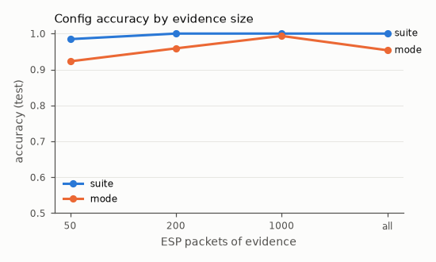
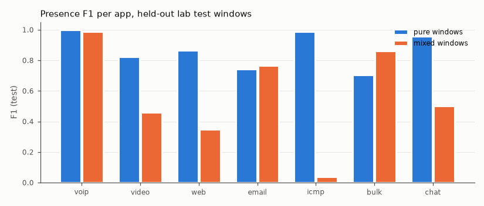
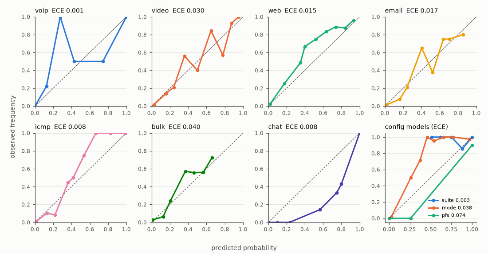
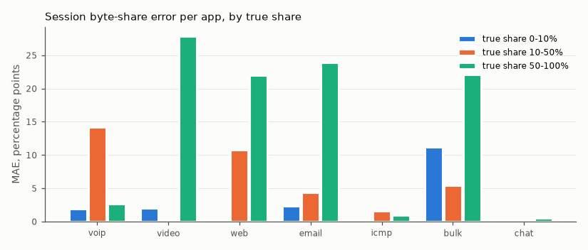
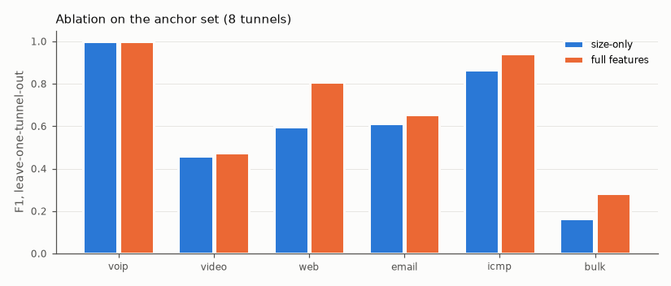
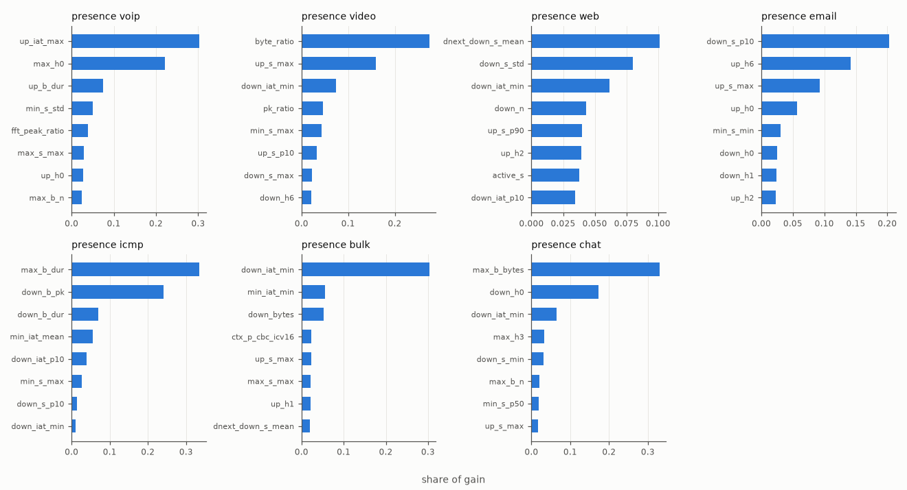

# Antardrishti analyzer: evaluation report (models/v1)

Generated by `python -m analyzer.evaluate` from the held-out test split. Nothing here was tuned on the test split: thresholds, calibration, early stopping and hyperparameters come from grouped out-of-fold predictions on the training split only. Spec: `analyzer/CLAUDE.md`.

## Headline

| model | metric | test |
|---|---|---|
| config: ESP suite (4 wire shapes) | accuracy, all packets | 100.0% |
| config: ESP suite | accuracy, first 50 ESP packets | 98.5% |
| config: mode (tunnel / transport) | accuracy, all packets | 95.4% |
| config: PFS (tunnels with a rekey) | accuracy, all packets | 92.9% |
| presence (7 apps) | macro F1, lab test windows | 0.851 |
| share (7 apps) | session byte-share MAE, pp (all apps, all buckets) | 4.41 |

| app | voip | video | web | email | icmp | bulk | chat |
|---|---|---|---|---|---|---|---|
| presence F1 | 0.996 | 0.797 | 0.786 | 0.751 | 0.928 | 0.747 | 0.951 |
| precision | 0.998 | 0.832 | 0.909 | 0.709 | 0.992 | 0.690 | 0.919 |
| recall | 0.994 | 0.764 | 0.693 | 0.797 | 0.872 | 0.815 | 0.986 |
| test positives | 642 | 433 | 316 | 306 | 439 | 771 | 139 |

## Findings

**What works.**
- **ESP suite** is read from sizes alone: 100% on the test tunnels with all packets, 98.5%
  from the first 50 ESP packets. The residues of the ESP length mod 16 carry it (each wire
  shape leaves its own residue: 8 + IV + ICV).
- **voip, icmp and chat** presence is near perfect on the lab test windows (F1 0.996, 0.928,
  0.951), with small session-share errors (0.0 to 2.6 pp where the app dominates).
- **Calibration** is good: presence ECE 0.001 to 0.040, suite 0.003, mode 0.038.

**What underperformed, and why.**
- **Video, bulk, email and web** (presence F1 0.75 to 0.80; session share MAE 22 to 28 pp
  when the app dominates) are mostly confused with each other. Inside ESP they are all TCP
  downloads from the same lab server: HLS segments, curl or scp files, IMAP attachments up
  to 5 MB, and mirrored pages. In a 2 s window their size histograms and inter-arrival
  times overlap; what separates them is structure over tens of seconds (segment cadence,
  think time, one long transfer), which the spec's window features only see through the
  neighbouring-window deltas.
  - The netem profile makes this worse: bulk F1 is 0.21 on `mobile` (60 ms, 1% loss) and
    video 0.47 on `congested`, where loss and rate limits flatten the transfers.
  - The ablation shows timing features matter (web 0.60 to 0.81, bulk 0.17 to 0.28 on the
    anchor set), so the P0 traffic runs' biased timing would have hurt.
- **Mixtures** are harder than single apps. Mixed-window F1: video 0.46, web 0.35, icmp
  0.04. A window's features pool every flow of the tunnel, so a small flow (pings, a page
  load) disappears next to a large one. The icmp+web test mixtures include
  `p1-icmp_web-21e3e3f0-r1`, 98% leaked bulk. There the pings sit under a bulk transfer,
  which the model does name (bulk predicted in 55% of those windows).
- **Mode** is 95.4% on the test tunnels, 100% on every stage except icmp-only tunnels. The
  mode shows in sizes only through the inner IP header (20 or 40 bytes), which needs a
  fixed-size reference packet such as a TCP ACK. The ping generator varies its payload
  size, so an icmp-only tunnel has no anchor. Leave one config out drops to 42 to 53% on
  two combinations (transport cbc-sha256 v4, tunnel gcm16 v4, no NAT-T). An unseen
  combination shifts every size, so its offsets are never seen together in training.
- **PFS** is 92.9% on 14 test tunnels. It depends on seeing a child rekey (set B handshake
  runs and a few edge cases); every other tunnel is "not determinable".
- **Out of distribution**:
  - *Realism* (the live internet): web is read mostly as bulk (session web share 7 to
    30% instead of 77 to 100%). Real sites send far more and larger objects than the 38
    mirrored lab pages, and QUIC flows (UDP 443) exist nowhere in the lab training data.
    Presence precision for web stays 1.0; recall is 0.39.
  - *WhatsApp*: voip calls transfer well (F1 0.94; 86% predicted share on both test
    calls). WhatsApp chat does not (F1 0.07): the Blend-60 scenario B test files are read
    as email. Only 92 training windows of WhatsApp chat exist, from other scenarios (A, C,
    D, E), against 317 of live XMPP chat, so the chat model mostly learned XMPP.

**Label decisions in numbers** (details below):
- Leaked bulk kept as bulk: 396 MB in 25 p0s runs over 1%, 95 MB in 3 anchor runs, 4.5 MB in
  one realism run. Leaked HTTPS in single-app runs, left unknown: 120 MB in p0s.
- Ambiguous HTTPS: the schedule resolves 13 to 19% of the ambiguous bytes. 645 video, 421 web
  and 224 bulk windows are unknown for those apps and left out.
- **The leak explains most of the P0 vs p0s volume gap.** With leaked bytes excluded, voip
  goes from 1.79x to 1.01x and icmp from 1.56x to 0.99x. Bulk's 2.22x is genuine (lan bulk at
  full speed alone on the machine), and web's 0.54x becomes 0.73x.

## Data and tier usage

Traffic models use p0s, P1 anchor, mixtures, chat, realism and WhatsApp; P0's 192 traffic runs are excluded (parallel capture distorted their timing and volume). Config models use every tier except e15, e16 and e19. Splits are each run's recorded split (WhatsApp by source file, p0s via its P0 twin); all 8 realism runs are test-only. CV groups are the config hash.

Config evidence rows (tunnels x evidence sizes):

| tier, split | rows |
|---|---|
| p0s|test | 184 |
| p0s|train | 552 |
| p0|test | 320 |
| p0|train | 985 |
| p1-whatsapp|test | 16 |
| p1-whatsapp|train | 43 |
| p1|test | 190 |
| p1|train | 456 |

Windows (2 s, per tunnel and SPI pair):

| tier stage split | windows |
|---|---|
| p0s traffic test | 1687 |
| p0s traffic train | 5105 |
| p1 anchor test | 277 |
| p1 anchor train | 875 |
| p1 chat test | 112 |
| p1 chat train | 317 |
| p1 mixtures test | 742 |
| p1 mixtures train | 2355 |
| p1 realism test | 218 |
| p1-whatsapp whatsapp test | 164 |
| p1-whatsapp whatsapp train | 333 |

| app | positive windows, train | positive windows, test |
|---|---|---|
| voip | 2332 | 724 |
| video | 1292 | 435 |
| web | 871 | 537 |
| email | 992 | 306 |
| icmp | 1344 | 439 |
| bulk | 2545 | 853 |
| chat | 479 | 221 |

## Label decisions (analyzer/CLAUDE.md section 11)

**Leaked bulk transfers.** Single-app runs take the run's app, except packets whose decrypted header names another lab app (almost always bulk over ssh), which keep that app. Packets whose header names no lab app (`other`: in single-app lab runs these are HTTPS or ping flows leaked from an earlier run, for which no app can be named) count as unknown bytes rather than the run's app. Realism windows take the run's app, web, whatever the port rule said (the QUIC-as-voip rule is ignored); only bulk keeps its own label there. Relabelled per tier and stage:

| tier stage | runs | runs relabelled | runs over 1% | ESP MB | MB kept as another app | MB unknown | by app (MB) |
|---|---|---|---|---|---|---|---|
| p0 traffic | 192 | 49 | 23 | 10015.2 | 754.1 | 0.7 | bulk 754.0, email 0.0, unknown 0.7 |
| p0s traffic | 192 | 46 | 25 | 17598.0 | 395.7 | 120.3 | bulk 395.7, email 0.0, unknown 120.3 |
| p1 anchor | 48 | 7 | 3 | 3178.2 | 94.8 | 0.0 | bulk 94.8, unknown 0.0 |
| p1 chat | 32 | 1 | 0 | 1.2 | 0.0 | 0.0 | unknown 0.0 |
| p1 realism | 8 | 1 | 1 | 107.7 | 4.5 | 0.0 | bulk 4.5 |
| p1-whatsapp whatsapp | 16 | 0 | 0 | 56.1 | 0.0 | 0.0 | - |

**Ambiguous HTTPS in mixtures.** Where only one candidate app is active in the schedule, the packet gets that app. Otherwise the window's presence and share are unknown for the candidate apps only (when the unresolved packets alone would reach the presence rule: 5 packets or 2% of the window's ESP bytes); those windows are left out of those apps' training and evaluation and out of their session-share scoring; the other apps' labels in the window stay exact.

| mixture | runs | ambiguous MB | resolved by schedule |
|---|---|---|---|
| video_bulk | 8 | 1531.7 | 12.6% |
| video_web | 8 | 383.8 | 14.1% |
| voip_video_web | 8 | 454.3 | 18.8% |

Windows left out, per app:

| app | train | test |
|---|---|---|
| voip | 0 | 0 |
| video | 497 | 148 |
| web | 328 | 93 |
| email | 0 | 0 |
| icmp | 0 | 0 |
| bulk | 169 | 55 |
| chat | 0 | 0 |

Windows left out, per unknown app set:

| apps (split) | windows |
|---|---|
| video+bulk (test) | 55 |
| video+bulk (train) | 169 |
| video+web (test) | 93 |
| video+web (train) | 328 |

## Config models

| model | 50 | 200 | 1000 | all |
|---|---|---|---|---|
| suite | 98.5% (F1 0.987, n 194) | 100.0% (F1 1.000, n 170) | 100.0% (F1 1.000, n 152) | 100.0% (F1 1.000, n 194) |
| mode | 92.3% (F1 0.920, n 194) | 95.9% (F1 0.958, n 170) | 99.3% (F1 0.993, n 152) | 95.4% (F1 0.951, n 194) |
| pfs | 100.0% (F1 1.000, n 1) | 100.0% (F1 1.000, n 1) | 100.0% (F1 1.000, n 1) | 92.9% (F1 0.928, n 14) |

Accuracy (macro-F1, test rows) by evidence size (ESP packets). PFS needs an observed child rekey; 75 rows qualify, every other tunnel is "not determinable".

Suite confusion (rows true, columns predicted; gcm16, cbc_icv12, cbc_icv16, cbc_icv24):

|  | gcm16 | cbc_icv12 | cbc_icv16 | cbc_icv24 |
|---|---|---|---|---|
| gcm16 | 190 | 0 | 3 | 0 |
| cbc_icv12 | 0 | 187 | 0 | 0 |
| cbc_icv16 | 0 | 0 | 206 | 0 |
| cbc_icv24 | 0 | 0 | 0 | 124 |

Mode confusion (transport, tunnel): [[275, 11], [21, 403]]; PFS (off, on): [[7, 1], [0, 9]]

Leave one config out (32 set-A combinations: mode, wire shape, outer family, NAT-T; each scored on its test rows by a booster trained on the other combinations):

| combination | suite acc | mode acc | rows |
|---|---|---|---|
| transport|cbc_icv12|v4|0 | 100.0% | 97.8% | 46 |
| transport|cbc_icv12|v6|0 | 100.0% | 100.0% | 2 |
| transport|cbc_icv12|v6|1 | 100.0% | 100.0% | 8 |
| transport|cbc_icv16|v4|0 | 98.4% | 53.1% | 64 |
| transport|cbc_icv16|v4|1 | 100.0% | 97.8% | 46 |
| transport|cbc_icv16|v6|0 | 100.0% | 100.0% | 8 |
| transport|cbc_icv24|v4|0 | 100.0% | 75.0% | 8 |
| transport|cbc_icv24|v4|1 | 100.0% | 100.0% | 2 |
| transport|cbc_icv24|v6|1 | 100.0% | 97.8% | 46 |
| transport|gcm16|v4|1 | 100.0% | 100.0% | 8 |
| transport|gcm16|v6|0 | 100.0% | 84.8% | 46 |
| transport|gcm16|v6|1 | 100.0% | 100.0% | 2 |
| tunnel|cbc_icv12|v4|0 | 100.0% | 100.0% | 12 |
| tunnel|cbc_icv12|v4|1 | 100.0% | 97.1% | 69 |
| tunnel|cbc_icv12|v6|0 | 100.0% | 100.0% | 4 |
| tunnel|cbc_icv12|v6|1 | 100.0% | 97.8% | 46 |
| tunnel|cbc_icv16|v4|0 | 100.0% | 100.0% | 16 |
| tunnel|cbc_icv16|v4|1 | 100.0% | 75.0% | 8 |
| tunnel|cbc_icv16|v6|0 | 100.0% | 93.1% | 58 |
| tunnel|cbc_icv16|v6|1 | 100.0% | 100.0% | 6 |
| tunnel|cbc_icv24|v4|0 | 100.0% | 90.0% | 50 |
| tunnel|cbc_icv24|v6|0 | 90.0% | 100.0% | 10 |
| tunnel|cbc_icv24|v6|1 | 100.0% | 100.0% | 8 |
| tunnel|gcm16|v4|0 | 89.1% | 41.8% | 55 |
| tunnel|gcm16|v4|1 | 95.8% | 97.9% | 48 |
| tunnel|gcm16|v6|0 | 100.0% | 97.1% | 34 |

Calibration (test): ECE suite 0.003 (top-class confidence), mode 0.038, PFS 0.074.

By stage (all-packet rows):

| stage | suite acc | mode acc | n |
|---|---|---|---|
| anchor | 100.0% | 83.3% | 12 |
| chat | 100.0% | 100.0% | 8 |
| edge | 100.0% | 94.4% | 18 |
| handshake | 100.0% | 100.0% | 12 |
| mixtures | 100.0% | 100.0% | 20 |
| realism | 100.0% | 100.0% | 8 |
| short | 100.0% | 100.0% | 16 |
| traffic | 100.0% | 93.8% | 96 |
| whatsapp | 100.0% | 100.0% | 4 |

## Presence

Per app on the lab test windows (p0s, anchor, mixtures, live chat), windows unknown for the app left out. Pure: at most one app present; mixed: two or more.

| app | threshold | F1 all | P | R | F1 pure | F1 mixed | mixed positives | ECE |
|---|---|---|---|---|---|---|---|---|
| voip | 0.429 | 0.996 | 0.998 | 0.994 | 0.999 | 0.989 | 192 | 0.001 |
| video | 0.360 | 0.797 | 0.832 | 0.764 | 0.823 | 0.459 | 39 | 0.030 |
| web | 0.400 | 0.786 | 0.909 | 0.693 | 0.866 | 0.349 | 71 | 0.015 |
| email | 0.403 | 0.751 | 0.709 | 0.797 | 0.744 | 0.767 | 91 | 0.017 |
| icmp | 0.421 | 0.928 | 0.992 | 0.872 | 0.988 | 0.038 | 51 | 0.008 |
| bulk | 0.318 | 0.747 | 0.690 | 0.815 | 0.704 | 0.860 | 248 | 0.040 |
| chat | 0.500 | 0.951 | 0.919 | 0.986 | 0.958 | 0.500 | 3 | 0.008 |

By netem profile (F1):

| netem | voip | video | web | email | icmp | bulk | chat |
|---|---|---|---|---|---|---|---|
| broadband | 0.997 | 0.821 | 0.881 | 0.800 | 0.990 | 0.868 | 0.970 |
| congested | 1.000 | 0.474 | 0.674 | 0.777 | 0.819 | 0.679 | 0.911 |
| lan | 0.997 | 0.884 | 0.829 | 0.867 | 0.903 | 0.907 | 0.984 |
| mobile | 0.989 | 0.831 | 0.942 | 0.578 | 1.000 | 0.211 | 0.967 |

By capture start (F1):

| capture_start | voip | video | web | email | icmp | bulk | chat |
|---|---|---|---|---|---|---|---|
| before_tunnel | 0.988 | - | 0.909 | - | 0.979 | 0.745 | 0.972 |
| mid_stream | 0.997 | 0.801 | 0.692 | 0.760 | 0.918 | 0.747 | - |

By stage (F1):

| stage | voip | video | web | email | icmp | bulk | chat |
|---|---|---|---|---|---|---|---|
| anchor | 1.000 | 0.762 | 0.889 | 0.842 | 0.973 | 0.517 | - |
| chat | - | - | - | - | - | - | 1.000 |
| mixtures | 0.994 | 0.549 | 0.685 | 0.726 | 0.239 | 0.762 | 0.943 |
| traffic | 0.999 | 0.863 | 0.877 | 0.748 | 0.992 | 0.766 | - |

Leave one config out (8 folds, mode x wire shape; trained on the other configs' training windows, scored on the fold's test windows with the main calibration and threshold):

| fold | voip | video | web | email | icmp | bulk | chat |
|---|---|---|---|---|---|---|---|
| transport|cbc_icv12 | 1.000 | 0.864 | 0.833 | 0.679 | 1.000 | 0.843 | 0.970 |
| transport|cbc_icv16 | 1.000 | 0.633 | 0.788 | 0.739 | 0.845 | 0.754 | 0.960 |
| transport|cbc_icv24 | 1.000 | 0.944 | 0.667 | 1.000 | 1.000 | 0.595 | 1.000 |
| transport|gcm16 | 1.000 | 0.811 | 0.909 | 0.900 | 0.951 | 0.761 | 0.957 |
| tunnel|cbc_icv12 | 0.994 | 0.738 | 0.705 | 0.750 | 0.816 | 0.680 | 0.914 |
| tunnel|cbc_icv16 | 0.989 | 0.936 | 0.875 | 0.286 | 1.000 | 0.000 | 0.970 |
| tunnel|cbc_icv24 | 1.000 | 0.831 | 0.968 | 0.952 | 0.988 | 0.667 | 1.000 |
| tunnel|gcm16 | 1.000 | 0.620 | 0.839 | 0.143 | 1.000 | 0.843 | 0.900 |

## Share

Mean absolute error in percentage points, bucketed by the true share (count in brackets). Session = one tunnel of one test run; shares are byte-weighted over the session's windows, absent apps zeroed and renormalised per window.

| app | session 0-10% | session 10-50% | session 50-100% | window 0-10% | window 10-50% | window 50-100% |
|---|---|---|---|---|---|---|
| voip | 1.9 (76) | 14.2 (3) | 2.6 (9) | 2.2 (2309) | 23.2 (84) | 1.1 (425) |
| video | 2.0 (70) | - (0) | 27.9 (12) | 2.0 (2237) | - (0) | 29.9 (433) |
| web | 0.3 (68) | 10.8 (3) | 21.9 (13) | 0.7 (2422) | 22.5 (16) | 27.4 (287) |
| email | 2.3 (74) | 4.3 (2) | 23.9 (12) | 2.9 (2532) | 23.9 (22) | 24.1 (264) |
| icmp | 0.0 (78) | 1.6 (1) | 0.9 (9) | 0.1 (2429) | 40.7 (1) | 1.3 (388) |
| bulk | 11.2 (67) | 5.5 (1) | 22.1 (18) | 9.6 (1992) | 13.8 (50) | 23.2 (721) |
| chat | 0.0 (80) | - (0) | 0.5 (8) | 0.3 (2681) | 52.8 (1) | 1.0 (136) |

Error bars in the CLI output are the out-of-fold session MAE per app and predicted-share bucket (training sessions):

| app | 0-10 | 10-50 | 50-100 |
|---|---|---|---|
| voip | 0.2 | 13.8 | 10.9 |
| video | 2.4 | 40.6 | 37.3 |
| web | 1.4 | 32.6 | 17.5 |
| email | 1.0 | 35.5 | 24.9 |
| icmp | 0.0 | 3.7 | 0.3 |
| bulk | 4.0 | 29.4 | 34.0 |
| chat | 0.9 | 80.9 | 6.9 |

## Out of distribution

**Realism** (internet, 8 runs, 218 windows, test-only). Labels: web, except leaked bulk.

| app | F1 | P | R | positives |
|---|---|---|---|---|
| web | 0.566 | 1.000 | 0.394 | 218 |
| bulk | 0.450 | 0.355 | 0.614 | 44 |

| run | web true | web pred | bulk true | bulk pred | unknown pred | largest wrong app |
|---|---|---|---|---|---|---|
| p1-inet-271c9924-r1 | 100.0 | 19.5 | 0.0 | 75.7 | 0.1 | voip 4.7 |
| p1-inet-460d098d-r1 | 100.0 | 17.6 | 0.0 | 63.8 | 18.0 | video 0.4 |
| p1-inet-57cad5b1-r1 | 100.0 | 12.1 | 0.0 | 87.6 | 0.1 | email 0.1 |
| p1-inet-7052c74c-r1 | 100.0 | 6.8 | 0.0 | 75.8 | 0.3 | voip 10.7 |
| p1-inet-ae7345d3-r1 | 100.0 | 20.9 | 0.0 | 76.4 | 0.3 | email 2.3 |
| p1-inet-cd2fa796-r1 | 100.0 | 12.9 | 0.0 | 78.1 | 8.9 | email 0.0 |
| p1-inet-d3d41cac-r1 | 76.9 | 30.0 | 23.1 | 43.8 | 3.9 | video 21.4 |
| p1-inet-eee460b0-r1 | 100.0 | 13.3 | 0.0 | 86.5 | 0.1 | email 0.1 |

**WhatsApp** (replayed public captures, test runs by source file):

| run | source | scenario / device | file | app | true % | pred % | active % | unknown % | windows |
|---|---|---|---|---|---|---|---|---|---|
| p1-whatsapp-40244c69-r1 | itc-net-audio-5 | audio5 / 192.168.137.218 | WhatsApp_99.pcap | voip | 100.0 | 86.3 | 82.9 | 10.7 | 41 |
| p1-whatsapp-9af2ee7b-r1 | itc-net-blend-60 | B / 192.168.137.121 | Whatsapp Messenger_B_3_Final.pcap | chat | 100.0 | 5.2 | 7.3 | 0.0 | 41 |
| p1-whatsapp-cebf608f-r1 | itc-net-blend-60 | B / 192.168.137.121 | Whatsapp Messenger_B_1_Final.pcap | voip | 100.0 | 86.0 | 92.7 | 0.0 | 41 |
| p1-whatsapp-d28c67b1-r1 | itc-net-blend-60 | B / 192.168.137.121 | Whatsapp Messenger_B_2_Final.pcap | chat | 100.0 | 0.0 | 0.0 | 0.0 | 41 |

| app | F1 (WhatsApp test windows) | P | R | positives |
|---|---|---|---|---|
| voip | 0.935 | 1.000 | 0.878 | 82 |
| chat | 0.067 | 0.429 | 0.037 | 82 |

## Ablation

Size-only (76 features: sizes, counts, histograms, balance, config context) vs full (138: plus inter-arrival, bursts, FFT, deltas), leave-one-tunnel-out over the anchor set (8 tunnels, 1152 windows), 200 rounds, threshold 0.5:

| features | voip | video | web | email | icmp | bulk |
|---|---|---|---|---|---|---|
| size | 1.000 | 0.460 | 0.597 | 0.613 | 0.867 | 0.166 |
| full | 0.998 | 0.477 | 0.809 | 0.656 | 0.943 | 0.283 |

## Feature importance

Top features by share of gain. Config models:

- **suite**: res16_4 0.23, res16_0 0.23, res16_8 0.21, res16_n 0.21, res16_share 0.03, res16_dom 0.03, evidence_n 0.01, up_min 0.01
- **mode**: up_min 0.36, up_p10 0.17, res16_n 0.11, up_p1 0.05, down_p10 0.04, family 0.04, up_p5 0.04, down_min 0.03
- **pfs**: ccsa_child_minus_ke 0.62, ccsa_child_req 0.20, ccsa_child_minus_ike 0.05, up_min 0.03, down_p5 0.03, up_n 0.01, family 0.01, down_n 0.01

Traffic models:

- **presence voip**: up_iat_max 0.30, max_h0 0.22, up_b_dur 0.07, min_s_std 0.05, fft_peak_ratio 0.04, max_s_max 0.03
- **presence video**: byte_ratio 0.27, up_s_max 0.16, down_iat_min 0.07, pk_ratio 0.05, min_s_max 0.04, up_s_p10 0.03
- **presence web**: dnext_down_s_mean 0.10, down_s_std 0.08, down_iat_min 0.06, down_n 0.04, up_s_p90 0.04, up_h2 0.04
- **presence email**: down_s_p10 0.20, up_h6 0.14, up_s_max 0.09, up_h0 0.06, min_s_min 0.03, down_h0 0.02
- **presence icmp**: max_b_dur 0.34, down_b_pk 0.24, down_b_dur 0.07, min_iat_mean 0.06, down_iat_p10 0.04, min_s_max 0.03
- **presence bulk**: down_iat_min 0.30, min_iat_min 0.06, down_bytes 0.05, ctx_p_cbc_icv16 0.02, up_s_max 0.02, max_s_max 0.02
- **presence chat**: max_b_bytes 0.33, down_h0 0.17, down_iat_min 0.06, max_h3 0.03, down_s_min 0.03, max_b_n 0.02
- **share voip**: max_s_p90 0.28, max_h0 0.12, tot_bytes 0.10, max_s_mean 0.08, tot_n 0.07, fft_peak_ratio 0.06
- **share video**: up_s_max 0.17, byte_ratio 0.17, up_s_mean 0.09, min_s_max 0.05, down_iat_min 0.04, up_s_p10 0.03
- **share web**: dnext_down_s_mean 0.15, up_h2 0.04, down_s_p90 0.04, down_iat_p10 0.04, tot_n 0.04, up_s_mean 0.04
- **share email**: down_s_p10 0.16, down_s_p50 0.10, up_h6 0.07, byte_ratio 0.07, up_s_max 0.07, down_s_max 0.03
- **share icmp**: max_b_dur 0.43, down_b_pk 0.32, down_b_dur 0.07, min_iat_mean 0.05, down_iat_p10 0.04, min_bytes 0.01
- **share bulk**: down_iat_min 0.28, down_bytes 0.07, min_iat_min 0.04, max_s_max 0.04, up_s_max 0.04, ctx_p_cbc_icv16 0.03
- **share chat**: max_b_bytes 0.20, min_h0 0.10, down_h0 0.07, down_iat_max 0.07, down_s_p10 0.05, down_iat_min 0.05

## P0 vs p0s (optional)

Paired twins, same config, app, netem and noise; only the capture concurrency (3 labs vs 1) and the run seed differ. Leaked bytes (packets not labelled the run's app) are excluded from both twins. The earlier "bulk 2.22x" packet ratio (`dataset/README.md`) counted leaked transfers too, so it may be partly due to the leak rather than concurrency alone.

| app | pairs | packets p0s/P0 | bytes p0s/P0 | packets p0s/P0 with leaks | median pair ratio of median IAT |
|---|---|---|---|---|---|
| bulk | 32 | 2.22 | 2.31 | 2.22 | 0.87 |
| email | 32 | 0.82 | 0.79 | 0.97 | 0.94 |
| icmp | 32 | 0.99 | 1.19 | 1.56 | 0.99 |
| video | 32 | 1.06 | 1.06 | 0.92 | 0.88 |
| voip | 32 | 1.01 | 1.02 | 1.79 | 1.00 |
| web | 32 | 0.73 | 0.59 | 0.54 | 1.05 |

## CLI

`python -m analyzer.cli analyze` on 3 test runs: 0.32 s per minute of traffic (median; 0.21 to 1.42).

## Environment

|  |  |
|---|---|
| os | Ubuntu 26.04 LTS |
| kernel | 6.6.87.2-microsoft-standard-WSL2 |
| cpu | 13th Gen Intel(R) Core(TM) i5-1335U |
| cores | 12 |
| mem_gb | 7.6 |
| python | 3.12.13 |
| libraries | numpy 2.5.3, pandas 3.0.6, pyarrow 25.0.1, lightgbm 4.7.0, scikit-learn 1.9.1, scipy 1.18.1, matplotlib 3.11.2, zstandard 0.25.0 |
| machine | owner's WSL2 Ubuntu machine (local, not a codespace) |

